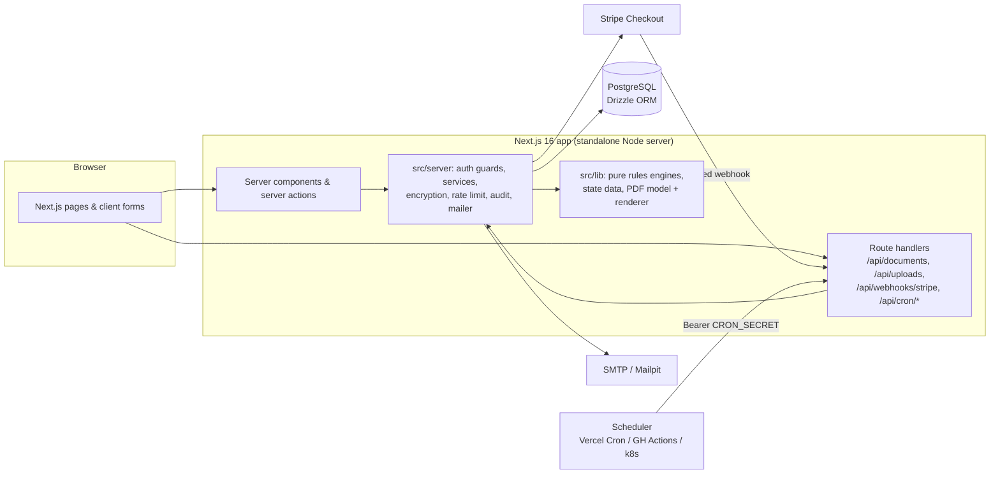

# Plainwill — Simple Will and Estate Service

A flat-fee service that walks anyone through setting up a will and files it properly.
Customers answer plain-English questions, pay once, download state-appropriate documents and a
signing kit, upload the signed will, and our staff deposit it with the court (where offered) or
keep it in our vault. The product name is configurable via `NEXT_PUBLIC_APP_NAME`.

> **Not a law firm.** Plainwill is a document-preparation and filing service. State rules and legal
> templates in this repository are **unreviewed defaults** — see
> [docs/LAUNCH_CHECKLIST.md](docs/LAUNCH_CHECKLIST.md) before accepting real customers.

## Features

- **Flat-fee pricing** (server-side config): Individual $99, Couple (two mirror wills) $169 —
  will PDF, state signing kit, 12 months of updates, vault storage, managed filing. Stripe Checkout
  one-time payment; idempotent `checkout.session.completed` webhook.
- **Guided will wizard**: 10 steps (about you, situation screening, children, guardians, executor,
  beneficiaries & residuary with basis-point shares, specific gifts, UTMA-style custodianship, other
  wishes, review), encrypted autosave, resumable, progress indicator, per-step validation, plain
  English review, watermarked DRAFT PDF previews. Couples can mirror the first will.
- **Rules engines** (pure, unit-tested): answer validation, complexity/eligibility screening
  (Louisiana blocked; estate tax over $15M (2026), business, special-needs beneficiary, disinheriting a
  spouse, non-citizen spouse, foreign assets, expected contest → attorney recommendation that must be
  acknowledged), 51-jurisdiction state rules (all `unreviewed`, startup warning), order status
  state machine with audited transitions.
- **Documents**: deterministic PDF generation (pdf-lib) of the will (numbered articles, attestation
  sized to the state's witness count, self-proving affidavit + notary block where available) and a
  state-specific signing-instructions kit, generated from an immutable SHA-256-hashed snapshot at payment.
- **Security**: AES-256-GCM encryption at rest with key ids for rotation, magic-byte upload checks,
  Postgres rate limiting, audit log (including every staff PII view), CSP/HSTS headers.
- **Execution & filing**: signed-scan upload, signing confirmation, court deposit (only where the
  state offers it) or vault safekeeping → staff filing queue.
- **Staff console**: orders search/filters, audited order detail, filing actions (sent / filed /
  vaulted), encrypted internal notes, audit log viewer (admin), state rules review table.
- **Customer dashboard**: status timeline, downloads, uploads, free updates for 12 months (new
  version, re-signing required), JSON data export, deletion request.
- **Emails & jobs**: order confirmation, documents ready, filing completed, signing reminders
  (`/api/cron/signing-reminders`, `npm run job:signing-reminders`, idempotent 7-day cadence).

## Architecture



More detail: [docs/ARCHITECTURE.md](docs/ARCHITECTURE.md).

## Quickstart

Requirements: Node 22, npm, Docker (for Postgres + Mailpit) or a local Postgres 16.

```bash
cp .env.example .env               # dev defaults; PAYMENTS_MODE=test-bypass simulates payment
docker compose up -d db mailpit    # Postgres on 5432, Mailpit SMTP 1025 / UI http://localhost:8025
npm ci
npm run db:migrate
npm run db:seed                    # prints demo credentials
npm run dev                        # http://localhost:3001
```

To receive emails in Mailpit set `SMTP_HOST=localhost` and `SMTP_PORT=1025` in `.env`
(otherwise emails are logged to the console).

### Demo accounts (from `npm run db:seed`)

| Role     | Email                     | Password              |
| -------- | ------------------------- | --------------------- |
| Admin    | `admin@plainwill.test`    | `Plainwill-demo-2026` |
| Staff    | `staff@plainwill.test`    | `Plainwill-demo-2026` |
| Customer | `customer@plainwill.test` | `Plainwill-demo-2026` |

The demo customer has four orders: a couple draft in progress, a paid order (documents ready), a
Texas order waiting for court deposit, and a California order stored in the vault.

## Scripts

| Script                                                     | What it does                                                                                            |
| ---------------------------------------------------------- | ------------------------------------------------------------------------------------------------------- |
| `npm run dev`                                              | Dev server on port 3001 (pretty logs)                                                                   |
| `npm run build`                                            | Production build (`.next/standalone`) + bundled `dist/migrate.mjs` and `dist/job-signing-reminders.mjs` |
| `npm start`                                                | Start the production build on port 3001                                                                 |
| `npm run lint` / `npm run format` / `npm run format:check` | ESLint 9 / Prettier                                                                                     |
| `npm run typecheck`                                        | `tsc --noEmit`                                                                                          |
| `npm test`                                                 | Vitest unit + integration tests (integration uses `TEST_DATABASE_URL`, default `simple_will_test`)      |
| `npm run test:unit` / `npm run test:integration`           | One project only                                                                                        |
| `npm run test:e2e`                                         | Playwright against the production build (run `npm run build` first)                                     |
| `npm run db:generate`                                      | Generate a SQL migration from `src/db/schema.ts`                                                        |
| `npm run db:migrate`                                       | Apply migrations in `drizzle/`                                                                          |
| `npm run db:seed`                                          | Seed admin, staff and demo customer data (idempotent)                                                   |
| `npm run job:signing-reminders`                            | Run the signing-reminder job once                                                                       |
| `npm run job:reencrypt [-- --apply]`                       | Re-encrypt mutable data after a key rotation                                                            |

## Environment variables

Every variable is documented in [.env.example](.env.example). Summary:

| Variable                                                                  | Required   | Purpose                                                            |
| ------------------------------------------------------------------------- | ---------- | ------------------------------------------------------------------ |
| `DATABASE_URL`                                                            | yes        | Postgres connection string                                         |
| `DATABASE_POOL_MAX`                                                       | no         | Pool size per instance (default 10)                                |
| `APP_URL`                                                                 | yes (prod) | Canonical base URL (auth, redirects, emails)                       |
| `NEXT_PUBLIC_APP_NAME` / `NEXT_PUBLIC_APP_URL`                            | no         | Branding / public URL (build time)                                 |
| `BETTER_AUTH_SECRET`                                                      | yes        | ≥32-char session signing secret                                    |
| `CLIENT_IP_HEADER`                                                        | no         | Platform header holding the client IP (e.g. `x-real-ip`, Vercel)   |
| `TRUSTED_PROXY_HOPS`                                                      | no         | Proxies appending to `X-Forwarded-For` (default 1, 0 = none)       |
| `DATA_ENCRYPTION_KEY`                                                     | yes        | 32-byte base64 AES-256-GCM key                                     |
| `DATA_ENCRYPTION_KEY_ID`                                                  | no         | Key id written into ciphertexts (default `k1`)                     |
| `DATA_ENCRYPTION_PREVIOUS_KEYS`                                           | no         | `id:key,…` old keys for decryption after rotation                  |
| `PAYMENTS_MODE`                                                           | no         | `stripe` (default) or `test-bypass` (non-production only)          |
| `STRIPE_SECRET_KEY` / `STRIPE_WEBHOOK_SECRET`                             | yes (prod) | Stripe API key and webhook signing secret                          |
| `STRIPE_API_BASE`                                                         | no         | Stripe API emulator URL — only honoured with `sk_test_` keys (e2e) |
| `SMTP_HOST` / `SMTP_PORT` / `SMTP_SECURE` / `SMTP_USER` / `SMTP_PASSWORD` | no         | SMTP; console logging when `SMTP_HOST` is empty                    |
| `EMAIL_FROM` / `SUPPORT_EMAIL`                                            | no         | Sender and support addresses                                       |
| `CRON_SECRET`                                                             | yes (prod) | Bearer token for `/api/cron/*`                                     |
| `LOG_LEVEL`                                                               | no         | pino level                                                         |
| `SKIP_ENV_VALIDATION`                                                     | build only | Skip env validation in `next build`; ignored by production servers |

## Testing

- **Unit** (`src/**/*.test.ts`): validation, screening, state data, state machines, pricing, dates,
  encryption round-trip/tamper detection, magic bytes, PDF document models and rendered PDF text.
- **Integration** (`tests/integration`): real Postgres (`simple_will_test`), migrations applied in
  global setup, tables truncated between tests. Covers wizard save/resume, Stripe webhook → paid →
  version snapshot → documents unlocked (+ idempotency, bad signatures, amount mismatch), IDOR
  protection on every object route, admin-only routes, the staff filing flow, uploads, reminders,
  updates, rate limiting and data export.
- **E2E** (`tests/e2e`, Playwright): against `next start` (production build). The payment step runs the
  real Stripe Checkout + signed webhook code path against a local Stripe API emulator
  (`tests/e2e/stripe-emulator.mjs`). The `PAYMENTS_MODE=test-bypass` shortcut is used for local
  development and integration tests only: env validation rejects it in production and Next.js
  compiles it out of production builds (`NODE_ENV` is inlined), so it cannot exist in production.

## Deployment

Docker image (multi-stage, non-root, `HEALTHCHECK`, `node migrate.mjs` for migrations) for any
container host, or Vercel + managed Postgres. GitHub Actions: `ci.yml` (lint → e2e + Docker build)
and `deploy.yml` (GHCR image → migrations → deploy hook). See
[docs/DEPLOYMENT.md](docs/DEPLOYMENT.md) and [docs/RUNBOOK.md](docs/RUNBOOK.md).

## Documentation

- [docs/ARCHITECTURE.md](docs/ARCHITECTURE.md) — code layout, data model, flows, security design
- [docs/DEPLOYMENT.md](docs/DEPLOYMENT.md) — Docker hosts, Vercel + Neon, Stripe, cron, backups
- [docs/RUNBOOK.md](docs/RUNBOOK.md) — on-call procedures
- [docs/LAUNCH_CHECKLIST.md](docs/LAUNCH_CHECKLIST.md) — everything a founder must do before launch
- [SECURITY.md](SECURITY.md) · [CONTRIBUTING.md](CONTRIBUTING.md)

## License

Proprietary — see [LICENSE](LICENSE).
