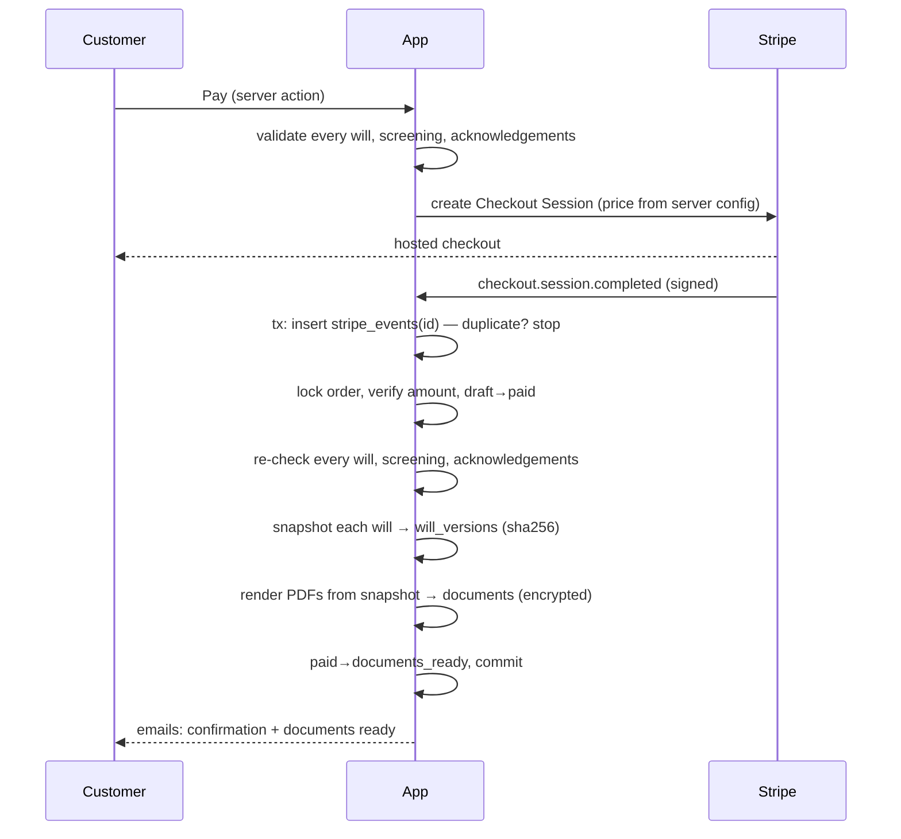

# Architecture

## Stack

Next.js 16 (App Router, React 19, TypeScript strict, Turbopack, `output: "standalone"`), Tailwind CSS 4,
Drizzle ORM + `pg` on PostgreSQL 16, Better Auth (email + password, DB sessions), Stripe Checkout,
pdf-lib, nodemailer, pino, Zod 4, Vitest 5, Playwright 1.56.

## Code layout

```
src/
  app/                 routes (pages, server actions, route handlers)
    (marketing)/       landing, pricing, legal pages
    (auth)/            sign-in / sign-up / password reset + auth server actions
    dashboard/         customer area: orders, wizard (wills/[willId]/[step]), account
    admin/             staff console (orders, filing queue, audit log, state rules)
    api/               health, ready, auth, stripe webhook, cron, documents, uploads, previews, export, admin JSON
  components/          UI (forms, wizard, order widgets)
  lib/                 PURE domain logic — no I/O, fully unit tested
    will/              answers schema, steps, validation, screening, summary, mirror wills, sample data
    documents/         document model, will + signing-instruction builders, PDF renderer
    states.ts          51-jurisdiction rules data (all unreviewed)
    order-status.ts    order state machine;  filing.ts  filing task rules
    pricing.ts config.ts dates.ts crypto.ts file-type.ts client-ip.ts
  server/              I/O: auth, session guards, encryption keyring, rate limiter, audit, mailer, stripe
    services/          orders, wills, payments, documents, execution, filing, updates, admin, account
  jobs/                signing-reminders (idempotent)
  db/                  Drizzle schema + pooled client
  env.ts               Zod env validation (lazy; SKIP_ENV_VALIDATION for `next build` only)
  proxy.ts             optimistic auth redirect (Next 16 "middleware")
  instrumentation.ts   startup warning for unreviewed state rules
drizzle/               committed SQL migrations (0001 adds immutability triggers + CHECK constraints)
scripts/               migrate, seed, jobs, esbuild bundler for the Docker image
tests/integration/     Vitest against the real test DB
tests/e2e/             Playwright + Stripe API emulator
```

## Data model

| Table                                        | Purpose                                                                                                     |
| -------------------------------------------- | ----------------------------------------------------------------------------------------------------------- |
| `user`, `session`, `account`, `verification` | Better Auth (user has `role`: customer / staff / admin)                                                     |
| `orders`                                     | One purchase (plan, status, amount in cents, payment refs, timestamps, update window, reminder bookkeeping) |
| `wills`                                      | 1 (individual) or 2 (couple) per order; encrypted autosaved draft, current step, completed steps            |
| `will_versions`                              | **Immutable** snapshot of answers at payment/update: encrypted canonical JSON + SHA-256, state code         |
| `documents`                                  | **Immutable** generated PDFs (will, signing instructions) per version, encrypted, with SHA-256              |
| `uploads`                                    | Encrypted signed-will scans (bytea) linked to the version they sign                                         |
| `filing_tasks`                               | Staff work items: court deposit or vault; tracking no., court ref, filed date; one open task per order      |
| `order_status_history`                       | Every status transition (from, to, actor, reason)                                                           |
| `order_notes`                                | Encrypted internal staff notes                                                                              |
| `audit_log`                                  | **Immutable** audit trail (actor, action, target, ids-only metadata, IP, UA)                                |
| `stripe_events`                              | Processed webhook event ids (idempotency)                                                                   |
| `rate_limits`                                | Fixed-window counters (key, window start)                                                                   |
| `email_log`                                  | Dedupe keys for transactional emails                                                                        |
| `account_deletion_requests`                  | Customer deletion requests (one pending per user)                                                           |

## Key flows

### Wizard

The client step form keeps the section in state, autosaves (debounced 1.2 s) through a server
action, and on "Save and continue" validates locally and again on the server with the same pure
`validateStep`. Drafts are stored as AES-256-GCM ciphertext bound to the will id (AAD). A step is
"complete" once submitted and still valid.

### Payment → documents



Everything inside the transaction rolls back on failure (including the event id), so Stripe's retry
is processed cleanly.

Answers stay editable while the customer is on the Stripe page, so the webhook re-runs the checkout
checks on the drafts it snapshots. If they no longer pass (or raise an unacknowledged warning), the
payment is recorded but the order stays `paid` without documents (`order.documents_held` in the
audit log); the order page asks the customer to fix the answers and confirm, which generates the
documents without charging again. A payment for an order that is no longer awaiting one (a second
checkout session, or an order cancelled during checkout) is logged as `payment.unexpected` for a
manual refund.

### Order status machine

`draft → paid → documents_ready → awaiting_execution → executed → filing_in_progress → filed | vaulted`,
plus `draft → cancelled` and `paid | documents_ready | awaiting_execution → refunded`. A will update
(free for 12 months) returns `awaiting_execution | executed | filed | vaulted → documents_ready`
because the new version must be signed again. Transitions use `SELECT … FOR UPDATE` plus a
conditional update on the previous status, and each one writes `order_status_history` and
`audit_log`.

### Execution & filing

The customer uploads a scan of every will (magic bytes: PDF/PNG/JPEG, ≤10 MB, encrypted), confirms
the signing and picks a filing method (court deposit only when `courtDepositOffered`). This moves
the order to `executed` then `filing_in_progress` and creates a `filing_tasks` row. Staff mark it
`sent_to_court` (tracking number) → `filed` (court reference + date) or `vaulted`, which completes
the order and emails the customer.

## Rules engines

- `lib/will/validation.ts` — blocking errors and non-blocking warnings, per step.
- `lib/will/screening.ts` — `block` (Louisiana) or `warn` findings with attorney recommendations;
  severities are configurable; warnings must be acknowledged at checkout. Estate-tax threshold lives
  in `lib/config.ts` (`$15,000,000` for 2026 — verify annually).
- `lib/states.ts` — witnesses (default 2), self-proving affidavit, notary, court deposit, notes,
  `legalReviewStatus: "unreviewed"`, `lastReviewedAt: null` for all 51 jurisdictions.

## Documents

Documents are built as a plain data model (`DocumentModel`) and then rendered with pdf-lib's
standard Times fonts. Rendering is deterministic (fixed metadata dates, no random ids): the same
snapshot produces byte-identical PDFs. Final PDFs are stored (encrypted) at generation time so the
exact signed document can always be re-downloaded even if templates change later. Standard PDF
fonts only cover Latin-1/WinAnsi; validation rejects other characters (see the launch checklist
for Unicode font embedding).

## Security

See [SECURITY.md](../SECURITY.md). Highlights: owner-scoped queries returning 404 for foreign ids,
staff PII views audited, encryption with row-bound AAD and key rotation, DB-level immutability for
legal records, rate limits in Postgres (per IP and per account; the client IP comes from
`lib/client-ip.ts` only, see DEPLOYMENT.md), strict headers.

## Honest limitations

- State rules and legal templates are unreviewed defaults.
- Refunds are not automated (no Stripe refund call); the `refunded` status exists for staff tooling.
- Account deletion is a manual staff process; retention rules must be defined by counsel.
- No MFA / email verification yet.
